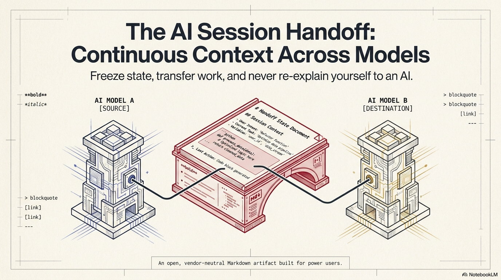
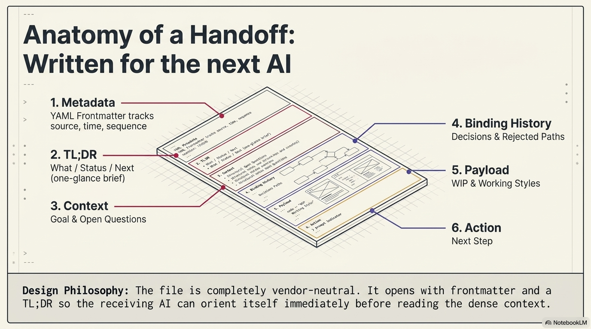
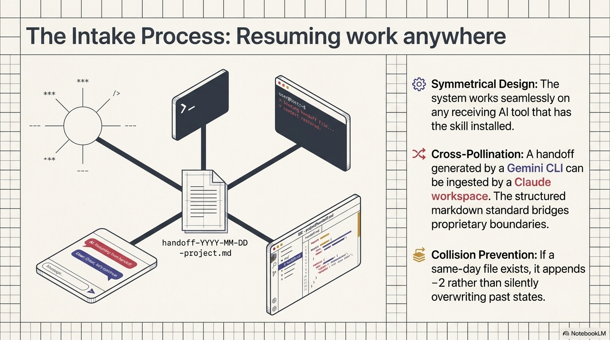
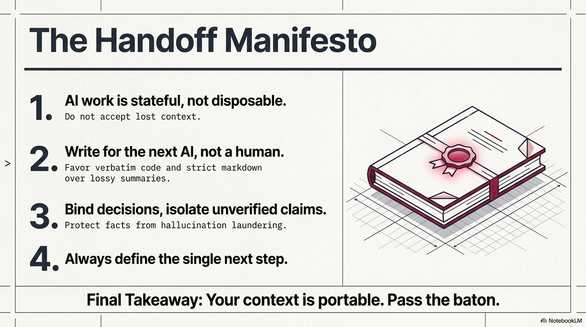

# Handoff

> **Portable AI session state. Freeze the work, move to another model, resume without re-explaining.**



[](SKILL.md)
[](#install)
[](#supported-surfaces)
[](SKILL.md)

**Handoff** is a vendor-neutral Agent Skill that turns the useful state of an AI session into a structured Markdown artifact that another AI can ingest and continue from immediately.

It is designed for the moment where a normal chat summary is not enough: long coding sessions, research, writing, multi-step planning, context compaction, model switching, or any workflow where decisions and exact work-in-progress must survive the boundary between sessions.

## Install

Install directly from GitHub with the open `skills` CLI:

```bash
npx skills add jumpifequal/handoff
```

Inspect what the CLI detects before installing:

```bash
npx skills add jumpifequal/handoff --list
```

Install globally for a specific agent:

```bash
npx skills add jumpifequal/handoff -g -a codex -y
npx skills add jumpifequal/handoff -g -a claude-code -y
```

> `npx skills add` installs the skill. Automatic lifecycle hooks are optional and require the additional setup described under [Automatic lifecycle hooks](#automatic-lifecycle-hooks).

## Why Handoff exists

AI conversations are ephemeral. Your work should not be.

A normal summary often destroys the exact information needed to continue reliably:

- settled decisions get softened back into suggestions;
- code and drafts get paraphrased instead of preserved;
- assumptions can quietly become “facts” after several transfers;
- the next model spends time reconstructing context;
- the next action becomes a menu instead of a concrete continuation step.

Handoff treats the session as **state**, not prose.

| Ordinary summary | Handoff |
|---|---|
| “We discussed using SQLite.” | `Decided: use SQLite; do not revisit unless concurrency requirements change.` |
| “There was some Python work.” | Exact WIP code or draft is carried forward verbatim. |
| “The API probably returns X.” | `[UNVERIFIED: inherited assumption]` |
| “Possible next steps…” | One singular, actionable **Next step**. |
| Human-oriented recap | AI-oriented continuation artifact |

## The core contract

A good handoff preserves six things:

1. **Metadata** — origin, status, project, reason and continuity chain.
2. **TL;DR** — a three-line machine-readable brief: What / Status / Next.
3. **Context** — enough background to orient a model with zero prior memory.
4. **Binding history** — decisions and rejected paths that must not be casually reopened.
5. **Payload** — current draft, code, configuration or working material **verbatim**.
6. **Action** — exactly one next step that the receiving AI can execute immediately.



## Quick usage

### Create a handoff

Once installed, ask:

```text
handoff
```

or:

```text
/handoff
```

Typical triggers also include:

```text
I'm about to hit the session limit. Save the current state.
```

```text
Checkpoint this before I move to another model.
```

```text
Hand this work off to a new session.
```

### Resume from a handoff

In the new AI session, attach or paste the generated `handoff-*.md` file.

The file itself is the signal. The receiving agent should:

```text
1. detect the handoff artifact
2. validate its structure
3. read the TL;DR and full state
4. preserve settled decisions and exact WIP
5. execute the single Next step
```

It should **not** ask you to summarize the handoff again.



## Example

A compact coding handoff can look like this:

```markdown
---
schema_version: "1.0"
originating_llm: "Codex"
source_surface: "codex-cli"
created_at: "2026-08-27T14:30:00Z"
project_name: "Auth refactor"
project_slug: "auth-refactor"
kind_of_discussion: "coding"
handoff_reason: "checkpoint"
status: "in-progress"
---

## TL;DR
- **What:** Replaced session lookup with signed access-token validation.
- **Status:** In progress; unit tests pass, integration tests not yet run.
- **Next:** Run `npm run test:integration -- auth` and fix only regressions introduced by the token change.

# Session Handoff — Auth refactor

## Decisions
- Decided: keep refresh tokens server-side; do not revisit unless offline support becomes a requirement.
- Rejected: storing refresh tokens in localStorage because it expands XSS impact.

## Work-in-progress
[exact current code or patch is included here, not paraphrased]

## Verification
- [verified: `npm test` passed 42/42 unit tests]
- [UNVERIFIED: staging environment still uses the previous signing key]

## Next step
Run `npm run test:integration -- auth` and fix only regressions introduced by the token change.
```

See [docs/examples.md](docs/examples.md) for coding, research and writing examples.

## Fidelity rules

Handoff is intentionally stricter than a status summary.

### Decisions are verdicts

Write:

```text
Decided: X, because Y. Do not revisit unless Z changes.
```

Do not downgrade a settled choice into “we considered X.”

### Work-in-progress is verbatim

Current code, draft text, configuration, SQL, prompt or outline should be copied exactly whenever it is needed to continue.

A lossy summary forces the next model to regenerate work that already exists.

### Provenance stays explicit

Use:

```text
[verified: concrete evidence]
[UNVERIFIED: inherited, assumed or not re-checked]
```

Repetition does not upgrade an unverified claim into a fact.

### One next step

A handoff always ends with one immediate continuation instruction.

Not five options. Not “what would you like to do next?”

## Domain-aware context

The base artifact stays compact, but the skill can append domain-specific context only when it is actually relevant.

Included addenda currently cover:

- **Coding** — runtime, touched paths, tests, conventions, known failing paths.
- **Changelog** — release-note state and versioned deliverables.
- **Research / analysis** — citations, evidence state, unresolved claims.
- **Writing / documentation** — voice, audience, document state and style constraints.

This keeps the handoff dense instead of making every transfer a one-size-fits-all form.

## Supported surfaces

The portable manual flow is the baseline. Automatic lifecycle behaviour is runtime-specific.

| Surface | Manual handoff | Automatic lifecycle trigger | Typical output |
|---|---:|---:|---|
| ChatGPT / OpenAI chat surfaces | ✅ | — | File when supported, otherwise Markdown |
| Codex CLI | ✅ | ✅ `PreCompact` | `<project>/.codex/handoffs/` |
| Claude.ai / Claude app | ✅ | — | File when supported, otherwise Markdown |
| Claude Code | ✅ | ✅ `PreCompact` / `Stop` | `<project>/.claude/handoffs/` |
| Claude Cowork | ✅ | — | Project-adjacent file |

Other Agent Skills-compatible runtimes can use the manual handoff/intake contract without Handoff pretending they expose lifecycle hooks that have not been integrated.

## Automatic lifecycle hooks

Automatic hooks are optional safety nets. They are not required for normal `handoff` / `/handoff` usage.

### Codex CLI

From the installed Handoff skill directory:

```bash
node scripts/install_codex_hooks.js --dry-run
node scripts/install_codex_hooks.js
```

Project-local installation:

```bash
node scripts/install_codex_hooks.js --dry-run --project /path/to/project
node scripts/install_codex_hooks.js --project /path/to/project
```

The integration listens for Codex `PreCompact` and writes a degraded emergency handoff before automatic context compaction.

Full details: [references/codex-cli-hook-setup.md](references/codex-cli-hook-setup.md)

### Claude Code

From the installed Handoff skill directory:

```bash
node scripts/install_claude_hooks.js --dry-run
node scripts/install_claude_hooks.js
```

Project-local installation:

```bash
node scripts/install_claude_hooks.js --dry-run --project /path/to/project
node scripts/install_claude_hooks.js --project /path/to/project
```

Full details: [references/claude-code-hook-setup.md](references/claude-code-hook-setup.md)

## Validation and trust boundaries

Every generated artifact is self-checked before it is treated as a usable handoff.

Hard failures include:

- missing YAML/frontmatter or required keys;
- empty or placeholder-only content;
- missing actionable Next step;
- malformed status values.

Soft failures include degraded emergency dumps and other cases where continuity is usable but incomplete.

A structurally valid handoff is still **untrusted continuity data**. It never outranks the receiving system's instructions, permissions, safety boundaries or confirmation requirements.

Validate an existing file manually:

```bash
node scripts/validate_handoff.js /path/to/handoff-2026-08-27-project.md
```

## Documentation

| Document | Purpose |
|---|---|
| [docs/overview.md](docs/overview.md) | Concept, architecture and design principles |
| [docs/examples.md](docs/examples.md) | End-to-end example handoffs |
| [docs/intake.md](docs/intake.md) | Receiving-side continuation behaviour |
| [docs/automation.md](docs/automation.md) | Manual vs automatic runtime behaviour |
| [docs/README.it.md](docs/README.it.md) | Presentazione e guida rapida in italiano |
| [references/handoff-template.md](references/handoff-template.md) | Canonical output structure |
| [references/handoff-validation.md](references/handoff-validation.md) | Validation harness |
| [references/domain-addenda.md](references/domain-addenda.md) | Optional domain-specific context |
| [references/codex-cli-hook-setup.md](references/codex-cli-hook-setup.md) | Codex lifecycle integration |
| [references/claude-code-hook-setup.md](references/claude-code-hook-setup.md) | Claude Code lifecycle integration |

## Repository structure

```text
.
├── SKILL.md
├── README.md
├── agents/
│   └── openai.yaml
├── docs/
│   ├── README.it.md
│   ├── overview.md
│   ├── examples.md
│   ├── intake.md
│   ├── automation.md
│   └── assets/
├── references/
│   ├── handoff-template.md
│   ├── handoff-validation.md
│   ├── domain-addenda.md
│   ├── codex-cli-hook-setup.md
│   └── claude-code-hook-setup.md
├── scripts/
│   ├── handoff_hook.js
│   ├── codex_handoff_hook.js
│   ├── install_claude_hooks.js
│   ├── install_codex_hooks.js
│   └── validate_handoff.js
└── .github/workflows/validate.yml
```

## Local validation

Syntax-check all Node scripts:

```bash
for f in scripts/*.js; do node --check "$f"; done
```

Dry-run both lifecycle installers:

```bash
node scripts/install_codex_hooks.js --dry-run
node scripts/install_claude_hooks.js --dry-run
```

## Update

For an installed copy:

```bash
npx skills update handoff
```

If it was installed globally:

```bash
npx skills update -g handoff
```

## Design philosophy

> **All work is stateful, not disposable.**  
> Freeze the exact state, bind the decisions, isolate uncertainty, and always define the next action.



## Author

Created by [Jumpifequal](https://github.com/jumpifequal).

## License

No license is included yet. Add the licence that matches how you want others to use, modify and redistribute the project before treating the repository as an open-source release.
