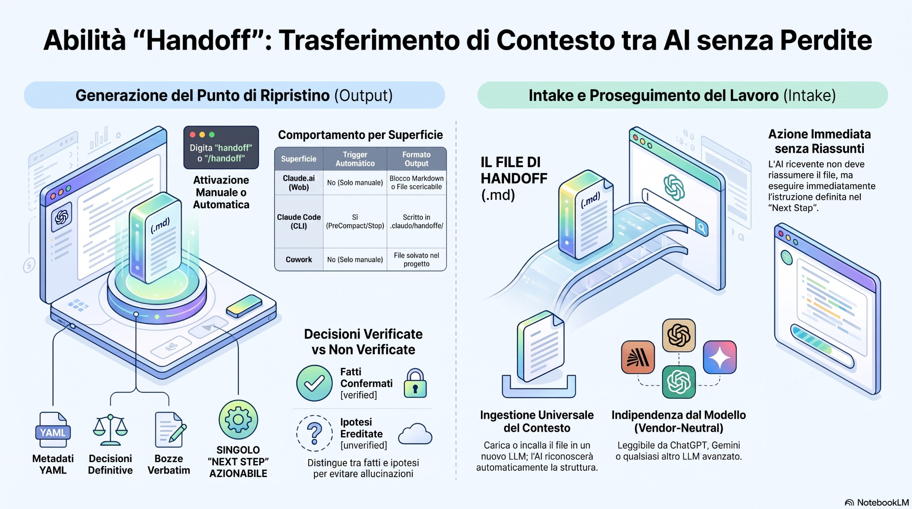

# Handoff — Guida Rapida in Italiano

**Handoff** trasferisce lo stato reale di una sessione AI in un file Markdown portabile, così un altro modello può continuare il lavoro senza perdere decisioni, codice, bozze, evidenze o il prossimo passo.



## Il problema

Quando una conversazione diventa lunga, il limite di contesto o il cambio di modello crea un punto di rottura.

Un normale riassunto tende a perdere esattamente ciò che serve per continuare bene:

- decisioni già prese;
- motivazioni dei percorsi scartati;
- codice o testo nella forma esatta;
- distinzione tra fatti verificati e ipotesi;
- istruzione precisa su cosa fare subito dopo.

Handoff crea invece un **punto di ripristino operativo**.

## Installazione

```bash
npx skills add jumpifequal/handoff
```

Per vedere prima cosa verrà rilevato:

```bash
npx skills add jumpifequal/handoff --list
```

## Uso

Per generare il file:

```text
handoff
```

oppure:

```text
/handoff
```

Puoi anche scrivere:

```text
Sto per cambiare modello. Salva lo stato del lavoro.
```

## Cosa contiene

Il file include:

1. **Metadati** — origine, progetto, stato, motivo del passaggio.
2. **TL;DR** — What / Status / Next.
3. **Contesto** — solo quello necessario.
4. **Decisioni vincolanti** — scelte chiuse e motivazioni.
5. **Work-in-progress verbatim** — codice, draft, config o testo esatto.
6. **Provenienza** — `[verified: ...]` e `[UNVERIFIED: ...]`.
7. **Un solo Next Step** — l'azione che la nuova AI deve eseguire subito.

## Intake: riprendere il lavoro

Nella nuova sessione allega il file `handoff-*.md`.

La AI ricevente non dovrebbe chiederti di riassumerlo di nuovo.

Il flusso corretto è:

```text
Riconosci il file
→ valida YAML e struttura
→ legge il TL;DR
→ recupera decisioni e WIP
→ mantiene verified / unverified
→ esegue il Next Step
```

## Decisioni: non sono semplici note

Meglio:

```text
Deciso: usare SQLite perché il deployment deve restare single-process.
Non riaprire la decisione salvo cambiamento del requisito di concorrenza.
```

Peggio:

```text
Abbiamo considerato SQLite.
```

La seconda formulazione permette alla nuova AI di riaprire una scelta che era già stata chiusa.

## Work-in-progress verbatim

Se esiste già un blocco di codice o una bozza, Handoff lo porta avanti nella forma esatta.

Un riassunto del codice obbligherebbe la nuova AI a rigenerarlo da una descrizione incompleta.

## Verificato vs non verificato

Handoff impedisce che un'ipotesi ripetuta in più sessioni diventi automaticamente un “fatto”.

```text
[verified: test suite 42/42 passata]
[UNVERIFIED: informazione ereditata dal precedente handoff, non ricontrollata]
```

## Addenda di dominio

Il protocollo aggiunge contesto specializzato solo quando serve:

- Coding;
- Changelog;
- Ricerca / Analisi;
- Scrittura / Documentazione.

In questo modo il file resta compatto ma conserva i dettagli realmente necessari.

## Automazione

Il comando manuale è universale.

Le automazioni sono specifiche per ambiente:

| Superficie | Manuale | Automatico |
|---|---:|---:|
| ChatGPT / OpenAI chat | ✅ | — |
| Codex CLI | ✅ | ✅ `PreCompact` |
| Claude.ai / App | ✅ | — |
| Claude Code | ✅ | ✅ hook |
| Cowork | ✅ | — |

Le automazioni sono un safety net: un handoff automatico può essere marcato `degraded` perché non equivale a un checkpoint curato manualmente.

## Filosofia

> Il lavoro è stato, non testo usa-e-getta.

Congela lo stato.  
Vincola le decisioni.  
Separa i fatti dalle ipotesi.  
Conserva il lavoro esatto.  
Definisci sempre il singolo prossimo passo.
